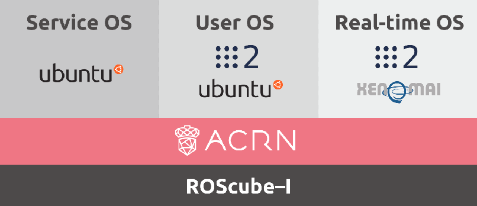

Getting Started Guide for ACRN Industry Scenario with ROScube-I
###############################################################

.. contents::
   :local:
   :depth: 1

Verified version
****************

- Ubuntu version: **18.04**
- GCC version: **7.5.0**
- ACRN-hypervisor branch: **release_2.1**
- ACRN-Kernel (Service VM kernel): **release_2.1**
- RT kernel for Ubuntu User OS: **Linux kernel 4.19.59 with Xenomai 3.1**
- HW: `ROScube-I <https://www.adlinktech.com/Products/ROS2_Solution/ROS2_Controller/ROScube-I?lang=en>`_

Architecture
************

In the tutorial, we'll guide you how install ACRN Industry Scenario on ROScube-I.
The scenario will be like the following:

Prerequisites
*************

* Connect the ROScube-I like the following:

  - HDMI for monitor.
  - Network on Ethernet port 1.
  - Keyboard and mouse on USB.

.. figure:: images/rqi-acrn-hw-connection.jpg

* Install Ubuntu 18.04 on ROScube-I.

* Modify the following BIOS settings.

.. csv-table::
   :widths: 15, 30, 10

   "Hyper-threading", "Advanced -> CPU Configuration", "Disabled"
   "Intel (VMX) Virtualization", "Advanced -> CPU Configuration", "Enabled"
   "Intel(R) SpeedStep(tm)", "Advanced -> CPU Configuration", "Disabled"
   "Intel(R) Speed Shift Technology", "Advanced -> CPU configuration", "Disabled"
   "Turbo Mode", "Advanced -> CPU configuration", "Disabled"
   "C States", "Advanced -> CPU configuration", "Disabled"
   "VT-d", "Chipset -> System Agent (SA) Configuration", "Enabled"
   "DVMT-Pre Allocated", "Chipset -> System Agent (SA) Configuration -> Graphics Configuration", "64M"

Install ACRN hypervisor
***********************

Setup Environment
=================

#. Open ``/etc/default/grub/`` and add ``idle=nomwait intel_pstate=disable`` in the end of GRUB_CMDLINE_LINUX_DEFAULT.

   .. figure:: images/rqi-acrn-grub.png

#. Update grub and then reboot.

   .. code-block:: bash

     sudo update-grub
     sudo reboot

#. Install the necessary libraries:

   .. code-block:: bash

     sudo apt update
     sudo apt install -y gcc \
       git \
       make \
       gnu-efi \
       libssl-dev \
       libpciaccess-dev \
       uuid-dev \
       libsystemd-dev \
       libevent-dev \
       libxml2-dev \
       libusb-1.0-0-dev \
       python3 \
       python3-pip \
       libblkid-dev \
       e2fslibs-dev \
       pkg-config \
       libnuma-dev \
       liblz4-tool \
       flex \
       bison
     sudo pip3 install kconfiglib

#. Get code from GitHub.

   .. code-block:: bash

     mkdir ~/acrn && cd ~/acrn
     git clone https://github.com/projectacrn/acrn-hypervisor -b release_2.1
     cd acrn-hypervisor

Configure Hypervisor
====================

#. Parse system information.

   .. code-block:: bash

     sudo apt install -y cpuid msr-tools
     cd ~/acrn/acrn-hypervisor/misc/acrn-config/target/
     sudo python3 board_parser.py ros-cube-cfl
     cp ~/acrn/acrn-hypervisor/misc/acrn-config/target/out/ros-cube-cfl.xml ~/acrn/acrn-hypervisor/misc/acrn-config/xmls/board-xmls/

#. Run ACRN configuration app and it'll open a browser page.

   .. code-block:: bash
 
     cd ~/acrn/acrn-hypervisor/misc/acrn-config/config_app
     sudo pip3 install -r requirements
     python3 app.py

   .. figure:: images/rqi-acrn-config-web.png

#. Select "Import Board info".

   .. figure:: images/rqi-acrn-config-import-board.png

#. Select target board name.

   .. figure:: images/rqi-acrn-config-select-board.png

#. Select "Scnario Setting" and choose "Load a default scenario".

   .. figure:: images/rqi-acrn-config-scenario-settings.png

#. Settings "HV": You can ignore this if your RAM is <= 16GB.

   .. figure:: images/rqi-acrn-config-hv-settings.png

#. Settings "VM0": Select the hard disk currently used.

   .. figure:: images/rqi-acrn-config-vm0-settings.png

#. Settings "VM1": Enable all the cpu_affinity.

   .. figure:: images/rqi-acrn-config-vm1-settings.png

#. Settings "VM2": Setup RT flags and enable all the cpu_affinity.

   .. figure:: images/rqi-acrn-config-vm2-settings1.png

   .. figure:: images/rqi-acrn-config-vm2-settings2.png

#. Export XML.

   .. figure:: images/rqi-acrn-config-export-xml.png

   .. figure:: images/rqi-acrn-config-export-xml-submit.png

#. Generate configuration files.

   .. figure:: images/rqi-acrn-config-generate-config.png

   .. figure:: images/rqi-acrn-config-generate-config-submit.png

#. Close the browser and stop the process (Ctrl+C).

#. Build hypervisor

   .. code-block:: bash

     cd ~/acrn/acrn-hypervisor
     make all BOARD_FILE=misc/acrn-config/xmls/board-xmls/ros-cube-cfl.xml SCENARIO_FILE=misc/acrn-config/xmls/config-xmls/ros-cube-cfl/user_defined/industry_ROS2SystemOS.xml RELEASE=0

#. Install hypervisor

   .. code-block:: bash

     sudo make install
     sudo mkdir /boot/acrn
     sudo cp ~/acrn/acrn-hypervisor/build/hypervisor/acrn.bin /boot/acrn/

Install Service VM kernel
*************************

Build Service VM kernel
=======================

#. Get code from GitHub

   .. code-block:: bash

     cd ~/acrn
     git clone https://github.com/projectacrn/acrn-kernel -b release_2.1
     cd acrn-kernel

#. Restore default ACRN configuration.

   .. code-block:: bash
 
     cp kernel_config_uefi_sos .config
     make olddefconfig
     sed -ri '/CONFIG_LOCALVERSION=/s/=.+/="-ROS2SystemSOS"/g' .config
     sed -i '/CONFIG_PINCTRL_CANNONLAKE/c\CONFIG_PINCTRL_CANNONLAKE=m' .config

#. Build Service VM kernel. It'll take some time.

   .. code-block:: bash
 
     make all

#. Install kernel and module.

   .. code-block:: bash
 
     sudo make modules_install
     sudo cp arch/x86/boot/bzImage /boot/acrn-ROS2SystemSOS

Update Grub
===========

#. Get the UUID and PARTUUID.

   .. code-block:: bash

     sudo blkid /dev/sda*

   .. note:: The UUID and PARTUUID we needs should be ``/dev/sda2``, which is ``TYPE="ext4"``.
             Just like the following graph:
   
   .. figure:: images/rqi-acrn-blkid.png

#. Update ``/etc/grub.d/40_custom`` as below. Remember to edit <UUID> and <PARTUUID> to yours.

   .. code-block:: bash
 
     menuentry "ACRN Multiboot Ubuntu Service VM" --id ubuntu-service-vm {
       load_video
       insmod gzio
       insmod part_gpt
       insmod ext2

       search --no-floppy --fs-uuid --set <UUID>
       echo 'loading ACRN Service VM...'
       multiboot2 /boot/acrn/acrn.bin  root=PARTUUID="<PARTUUID>"
       module2 /boot/acrn-ROS2SystemSOS Linux_bzImage
     }
  
   .. figure:: images/rqi-acrn-grun-40_custom.png

#. Update ``/etc/default/grub`` to make grub menu visible and load Service VM as default.

   .. code-block:: bash

     GRUB_DEFAULT=ubuntu-service-vm
     #GRUB_TIMEOUT_STYLE=hidden
     GRUB_TIMEOUT=5 

#. Then update grub and reboot.

   .. code-block:: bash

     sudo update-grub
     sudo reboot

#. ``ACRN Multiboot Ubuntu Service VM`` entry will be shown grub menu and choose it to load ACRN.
   You can check whether the installation is successful or not by dmesg.

   .. code-block:: bash

     sudo dmesg | grep ACRN
  
   .. figure:: images/rqi-acrn-dmesg.png

Install User VM
***************

Before create User VM
=====================

#. Download Ubuntu image (Here we use `Ubuntu 18.04.5 LTS <https://releases.ubuntu.com/18.04.5/>`_ as example):

#. Install necessary packages.

   .. code-block:: bash

     sudo apt install qemu-kvm libvirt-clients libvirt-daemon-system bridge-utils virt-manager ovmf
     sudo reboot

Create User VM image
====================

.. note::

  Please create User VM image on **native Linux kernel**, not ACRN kernel, or you'll get the error message.

#. Start virtual machine manager application.

   .. code-block:: bash

     sudo virt-manager

#. Create a new virtual machine.

   .. figure:: images/rqi-acrn-kvm-new-vm.png

#. Select your ISO image path.

   .. figure:: images/rqi-acrn-kvm-choose-iso.png

#. Select CPU and RAM for the VM.
   You can modify as high as you can to accelerate the installation time.
   The settings here is not related to the resource of UOS on ACRN, which can be decided later.

   .. figure:: images/rqi-acrn-kvm-cpu-ram.png

#. Select disk size you want. **Note that this can't be modified after creating image!**

   .. figure:: images/rqi-acrn-kvm-storage.png

#. Edit image name and select "Customize configuration before install".

   .. figure:: images/rqi-acrn-kvm-name.png

#. Select correct Firmware, apply it, and Begin Installation.

   .. figure:: images/rqi-acrn-kvm-firmware.png

#. Now you'll see the installation page of Ubuntu.
   After install Ubuntu, you can also install some necessary packages, like ssh, vim, ROS 2...etc.
   We'll clone the image for realtime VM, and this can save your time.

#. To install ROS 2, please refer to `Installing ROS 2 via Debian Packages <https://index.ros.org/doc/ros2/Installation/Dashing/Linux-Install-Debians/>`_

#. Poweroff the VM after complete.

   .. code-block:: bash

     sudo poweroff

Run User VM
===========

#. Install dependency.
   The origin version of iasl is too old for ACRN and should be upraged.

   .. code-block:: bash

     sudo apt install iasl
     cd /tmp
     wget https://acpica.org/sites/acpica/files/acpica-unix-20191018.tar.gz
     tar zxvf acpica-unix-20191018.tar.gz
     cd acpica-unix-20191018
     make clean && make iasl
     sudo cp ./generate/unix/bin/iasl /usr/sbin/

#. Convert KVM image file format.

   .. code-block:: bash

     mkdir -p ~/acrn/uosVM
     cd ~/acrn/uosVM
     sudo qemu-img convert -f qcow2 -O raw /var/lib/libvirt/images/ROS2SystemUOS.qcow2 ./ROS2SystemUOS.img

#. Prepare a Launch Script File.

   .. code-block:: bash

     wget https://raw.githubusercontent.com/Adlink-ROS/ROScube_ACRN_guide/master/scripts/launch_ubuntu_uos.sh
     chmod +x ./launch_ubuntu_uos.sh 

#. Setup network and reboot to take effect.

   .. code-block:: bash

     mkdir -p ~/acrn/tools/
     wget https://raw.githubusercontent.com/Adlink-ROS/ROScube_ACRN_guide/master/scripts/acrn_bridge.sh
     chmod +x ./acrn_bridge.sh
     ./acrn_bridge.sh
     sudo reboot

#. Reboot to ACRN kernel and now you can launch the VM.

   .. code-block:: bash

     cd ~/acrn/uosVM
     sudo ./launch_ubuntu_uos.sh

Install Real-Time VM
********************

Copy Real-Time VM image
=======================

.. note::

  Please create Real-Time VM image on **native Linux kernel**, not ACRN kernel, or you'll get the error message.

#. Clone Real-Time VM from User VM. (Right click User VM and then clone)

   .. figure:: images/rqi-acrn-rtos-clone.png

#. You'll see the Real-Time VM is ready.

   .. figure:: images/rqi-acrn-rtos-ready.png

Setup Real-Time VM
==================

#. Run the VM and modify your VM hostname.

   .. code-block:: bash

     hostnamectl set-hostname ros-RTOS

#. Install Xenomai kernel.

   .. code-block:: bash

     sudo apt install git build-essential bison flex kernel-package libelf-dev libssl-dev haveged
     git clone -b F/4.19.59/base/ipipe/xenomai_3.1 https://github.com/intel/linux-stable-xenomai
     cd linux-stable-xenomai && make acrn_defconfig
     CONCURRENCY_LEVEL=$(nproc) make-kpkg --rootcmd fakeroot --initrd kernel_image kernel_headers
     sudo dpkg -i ../*.deb

#. Install Xenomai library and tools.
   For more detail, please refer to `Xenomai Official Documentation <https://gitlab.denx.de/Xenomai/xenomai/-/wikis/Installing_Xenomai_3#library-install>`_.

   .. code-block:: bash

     wget https://xenomai.org/downloads/xenomai/stable/xenomai-3.1.tar.bz2
     tar xf xenomai-3.1.tar.bz2
     cd xenomai-3.1
     sudo ./configure --with-core=cobalt \
            --enable-smp \
            --enable-pshared
            --enable-dlopen-libs \
            --enable-tls
     make -j`nproc`
     sudo make install

#. Allow non-root user to run Xenomai

   .. code-block:: bash

     sudo addgroup xenomai --gid 1234
     sudo addgroup root xenomai
     sudo usermod -a -G xenomai $USER

#. Update ``/etc/default/grub``.

   .. code-block:: bash

     GRUB_DEFAULT=ubuntu-service-vm
     #GRUB_TIMEOUT_STYLE=hidden
     GRUB_TIMEOUT=5 
     ...
     GRUB_CMDLINE_LINUX="i915.enable_rc6=0 i915.enable_dc=0 i915.disable_power_well=0 i915.enable_execlists=0 i915.powersave=0 processor.max_cstate=0 intel.max_cstate=0 processor_idle.max_cstate=0 intel_idle.max_cstate=0 clocksource=tsc tsc=reliable nmi_watchdog=0 nosoftlockup intel_pstate=disable idle=poll noht nosmap mce=ignore_mce nohalt acpi_irq_nobalance noirqbalance vt.handoff=7 rcu_nocb_poll nohz_full=1 xenomai.allowed_group=1234 nosmt"

#. Update GRUB.

   .. code-block:: bash

     sudo update-grub

#. Poweroff the VM.

   .. code-block:: bash

     sudo poweroff

Run Real-Time VM
================

#. Convert KVM image file format.

   .. code-block:: bash

     mkdir -p ~/acrn/rtosVM
     cd ~/acrn/rtosVM
     sudo qemu-img convert -f qcow2 -O raw /var/lib/libvirt/images/ROS2SystemRTOS.qcow2 ./ROS2SystemRTOS.img

#. Create a new launch file

   .. code-block:: bash

     wget https://raw.githubusercontent.com/Adlink-ROS/ROScube_ACRN_guide/master/scripts/launch_ubuntu_rtos.sh
     chmod +x ./launch_ubuntu_rtos.sh

#. Reboot to ACRN kernel and now you can launch the VM.

   .. code-block:: bash

     cd ~/acrn/rtosVM
     sudo ./launch_ubuntu_rtos.sh

.. note::

  Please use poweroff instead of reboot in Real-Time VM.
  In ACRN design, the system will also reboot while rebooting Real-Time VM.

About the Launch File
*********************

The launch file in this tutorial have the following hardware resource allocation.

.. csv-table::
   :header: "Resource", "Service VM", "User VM", "Real-Time VM"
   :widths: 15, 15, 15, 15

   "CPU", "0", "1,2,3", "4,5"
   "Memory", "Remaining", "8 GB", "2 GB"
   "Ethernet", "Ethernet 1 & 2", "Ethernet 3", "Ethernet 4"
   "USB", "Remaining", "1-2", "1-1"

You can modify the launch file for your own hardware resource allocation.
We'll provide some modification methods below.
For more detail, please refer to `Device Model Parameters <https://projectacrn.github.io/latest/user-guides/acrn-dm-parameters.html>`_

CPU
===

Modify the number behind ``--cpu-affinity`` in the command acrn-dm.
The number should be from 0 to max CPU id.
For example, if you want to run VM with core 1 and 2, it'll be ``--cpu-affinity 1,2``.

Memory
======

Modify the ``mem_size`` in launch file. This variable will be passed to acrn-dm.
The possible values are 1024M, 2048M, 4096M, 8192M.

Ethernet
========

Run ``lspci -Dnn | grep "Ethernet controller"`` to get the ID of Ethernet port.

.. figure:: images/rqi-acrn-ethernet-lspci.png

You'll see 4 ID for each Ethernet port.
Assign the ID of the port you want to passthrough in the launch file.
For example, if we want to passthrough Ethernet 3 to the VM:

.. code-block:: bash

  passthru_vpid=(
  ["ethernet"]="8086 1539"
  )
  passthru_bdf=(
  ["ethernet"]="0000:04:00.0"
  )

  # Passthrough ETHERNET
  echo ${passthru_vpid["ethernet"]} > /sys/bus/pci/drivers/pci-stub/new_id
  echo ${passthru_bdf["ethernet"]} > /sys/bus/pci/devices/${passthru_bdf["ethernet"]}/driver/unbind
  echo ${passthru_bdf["ethernet"]} > /sys/bus/pci/drivers/pci-stub/bind

  acrn-dm
  ⋮
  -s 4,passthru,04/00/0 \
  ⋮

USB
===

To passthrough USB to VM, we need to know the ID for each USB first.

.. figure:: images/rqi-acrn-usb-port.png

Then modify the launch file and add the USB ID.
For example, if you want to passthrough USB 1-2 and 1-4.

.. code-block:: bash

  acrn-dm
  ⋮
  -s 8,xhci,1-2,1-4 \
  ⋮